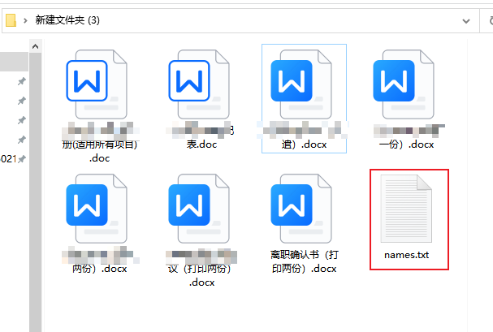
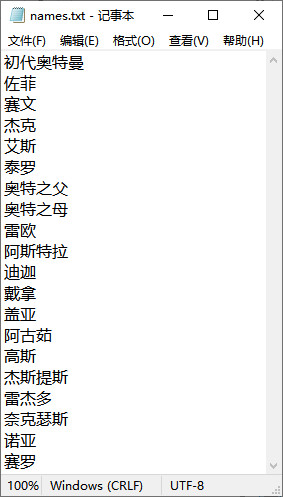
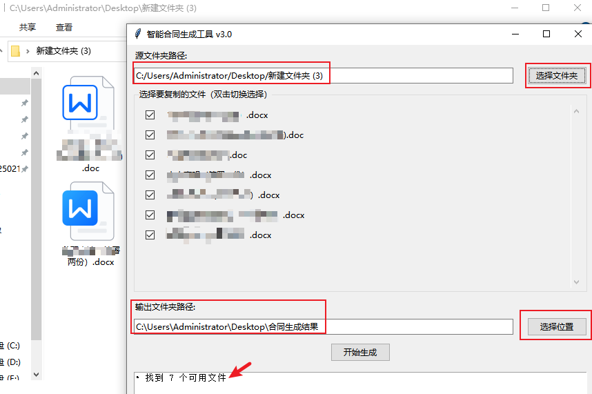
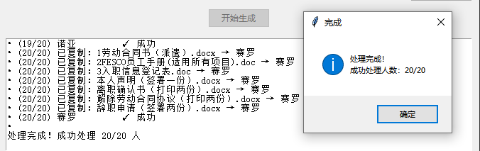
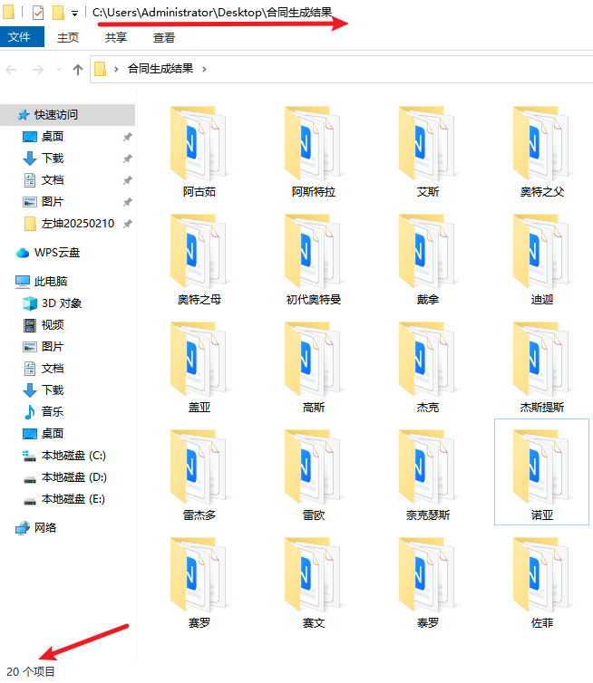

# 项目说明
在生活中，我们以大学辅导员为例，学校工作中最常见的一类需求是学生档案的简历。

假如说一个班有35位同学，每位同学档案由5个文件构成，然后每个文件中都会有他的信息，还有其他固有信息。

通常的默认做法是，新建一个文件夹，然后快速复制，然后修改好文件名，然后逐个文件夹里复制5个文件，最后逐一修改。

这样机械的重复工作不仅耽误时间，并且很消磨人的精神。

那么今天我基于python语言写作封装的小工具，只需要3秒就能快速处理好，除了最后一步【逐一修改信息】之外的全部工作。

希望能对你有用。

# 学生档案批量处理工具


## 🚀 工具价值
**大学辅导员/档案管理员的效率革命**  
传统处理35人班级档案需要约30分钟，本工具3秒完成自动化处理！

🛠️ 快速开始
📥 极简使用流程

### 第一步：准备文件
1. 新建任意名称文件夹（建议命名为`学生档案`）
2. 在文件夹中创建 `names.txt`，每行一个学生姓名  
3. 将要复制的模板文件放入该文件夹（支持所有文件类型）




第二步：运行工具
1. [下载最新版工具](https://your-download-link.com/contract_gui.exe)
2. 双击运行 `contract_gui.exe`


第三步：可视化操作
```diff
+ 图形界面操作指引：
1. 点击【选择文件夹】按钮，选中准备好的文件夹
2. 勾选需要复制的模板文件（支持多选）
3. 点击【开始生成】查看实时进度条
4. 完成提示后点击【打开目录】查看结果




## 📁 典型用户场景
```diff
- 传统低效流程：
  1. 新建35个学生文件夹
  2. 每个文件夹内复制5个模板文件
  3. 手动重命名所有文件
  4. 逐个打开文件修改学生信息
+ 智能处理流程：
  1. 准备好学生名单和模板文件
  2. 运行本工具
  3. 直接进入最终信息修改阶段


✨ 核心功能
🖱️ 一键式操作

🔍 智能识别系统
自动检测names.txt文件编码（支持GBK/UTF-8）
智能过滤系统隐藏文件（如 thumbs.db）
自动跳过已存在的学生文件夹
生成完成后自动打开目标目录

📌 常见问题
如何更新学生名单？
直接修改文件夹内的names.txt文件，删除不需要的行或添加新行

文件没有复制成功怎么办？
检查文件是否被其他程序占用
确认文件名不包含特殊字符 / \ : * ? " < > |

支持批量修改文件内容吗？
当前版本已完成文件创建和命名，内容修改功能开发中（预计v2.0支持  我太菜了还没搞定）


🛠️ 技术支持
遇到问题请提供：

工具界面截图
names.txt文件内容（敏感信息可打码）
系统错误提示截图
联系开发者：peter-zx (1420229579@qq.com)
提交问题反馈


🤝 贡献指南
欢迎通过Issue提交需求或参与开发：

1.Fork本仓库
2.创建特性分支 (git checkout -b feature/新功能)
3.提交修改 (git commit -am '添加新功能')
4.推送分支 (git push origin feature/新功能)
5.发起Pull Request

📄 开源协议
本项目采用 MIT License
作者：Peter-ZX (1420229579@qq.com)